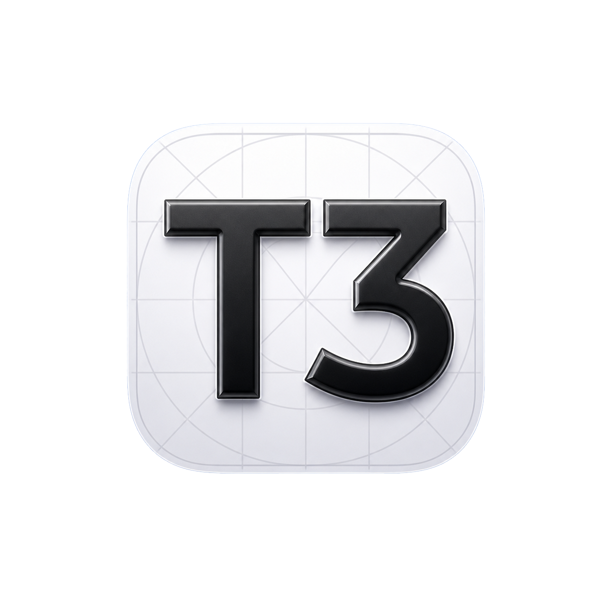

<p align="center">
  
</p>

# lct3

lct3 is a rebuilt SwiftUI iPhone client for T3 Code, forked from [T3 Code](https://github.com/pingdotgg/t3code).
It pairs to any T3 Code server and turns an agent thread into a device IPA: it asks the server
to build your project's iOS app, streams the artifact to the phone, and runs it on-device through
the LiveContainer runtime. Everything else in T3 Code — the server, web app, desktop app, and the
provider adapters — is here too, kept current with upstream.

## What it adds

- **Run iOS App from a thread.** Pick an Xcode project or a build recipe, and the server builds a
  device IPA with status streaming, a watchdog, and deterministic, content-addressed artifacts.
- **On-device runtime.** Verifies artifact integrity (SHA-256), installs with rollback, and manages
  the signing certificate lifecycle inside the sideloaded Live app.
- **Resilient transfer.** Signed URLs with a chunked, resumable fallback for older servers.

## Install

There are no releases yet — build from source. You need a Mac with a current Xcode and iOS 17+.

```bash
git clone https://github.com/ehfreema/lct3.git
cd lct3
xcodebuild -project apps/swift-ios/T3Code.xcodeproj -scheme T3Code -configuration Release \
  -destination 'generic/platform=iOS' -derivedDataPath apps/swift-ios/.derivedData-device build
```

The build is unsigned by default. Sideload the resulting `T3Code.app` into the LiveContainer
runtime, or sign it with your own developer identity. Then start a T3 Code server on your machine
(`npx t3@latest`) and pair the phone over your network with the pairing URL.

For day-to-day development and testing, run the Debug build on a simulator:

```bash
xcodebuild -project apps/swift-ios/T3Code.xcodeproj -scheme T3Code \
  -destination 'platform=iOS Simulator,name=iPhone 17 Pro' build
```

## Server and web

The T3 Code server, web app, and desktop app live in this repository and work as upstream:

```bash
vp i
vp run dev
```

## Documentation

- [Build and run an iPhone app](docs/user/run-ios-apps.md)
- [On-device runtime internals](docs/internals/ios-app-runtime.md)
- [Install and first run](docs/user/install.md) · [Remote access](docs/user/remote-access.md)
- Full docs live in [docs/](docs). The [upstream README](https://github.com/pingdotgg/t3code#readme)
  covers everything T3 Code does.

## About this fork

lct3 is a personal fork of T3 Code, MIT-licensed like upstream. Upstream attribution and the
original license remain in [LICENSE](LICENSE). T3 Code itself is developed at
[pingdotgg/t3code](https://github.com/pingdotgg/t3code).
